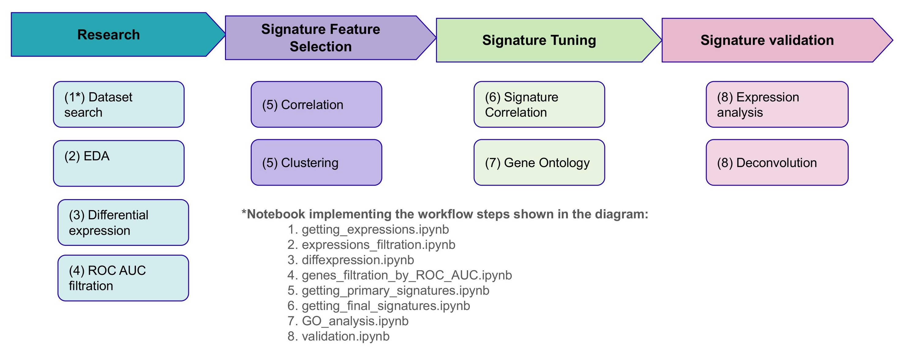
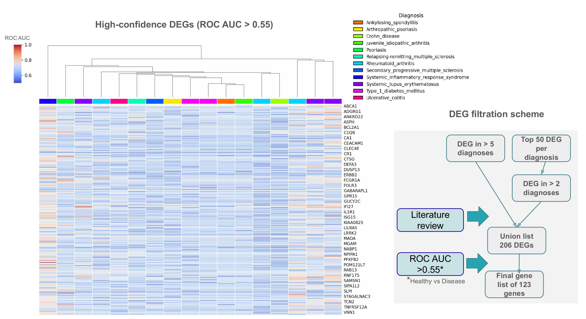
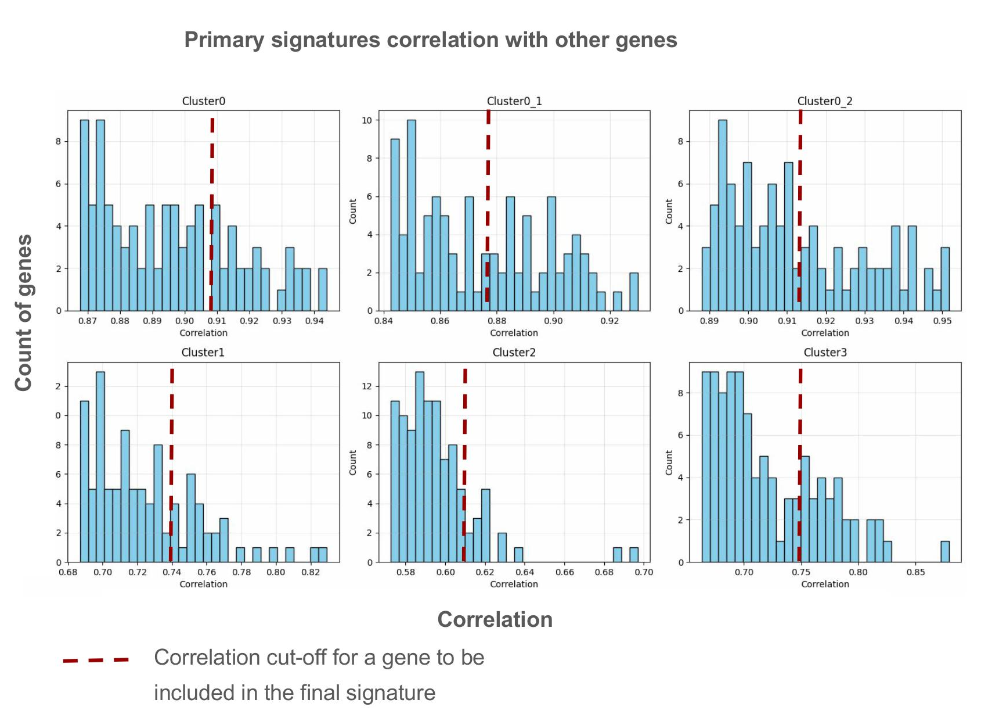
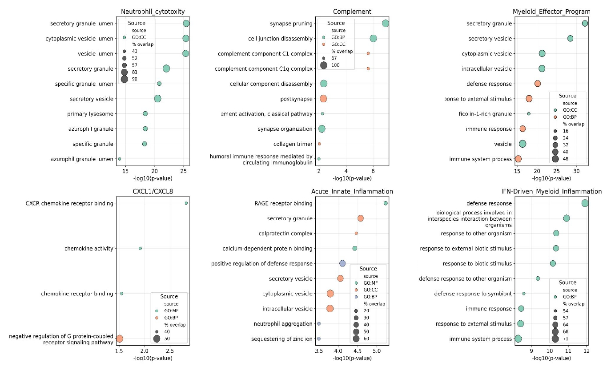
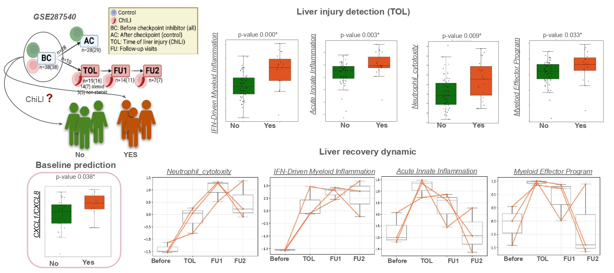
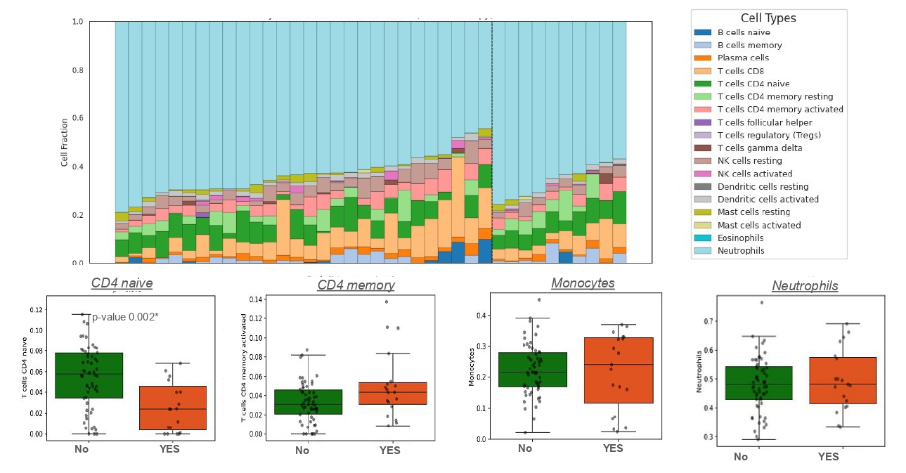

# Diagnostic Myeloid Signatures in Peripheral Blood of Autoimmune Diseases
> **Ekaterina Lebedeva**</br>
> tg: *@katya_lebe* </br>
> email: *EkaterinaLebedeva2612@gmail.com*

>**Supervisor**: Alexander Zaytsev

This repository contains the results of the bioinformatics analysis for my scientific thesis project (Bioinformatics Institute, 2024–2025).


---
## Overall
Repository provides a reproducible analysis workflow for investigating myeloid gene expression signatures associated with autoimmune diseases and immunotherapy-related complications, using public bulk RNA-seq data.

It illustrates a typical transcriptomic analysis pipeline and is intended as a research resource, not a standalone software tool.
All code and intermediate data are included to support transparency and reuse.

>Required software and packages (Python/R) are listed in [requirements.txt](requirements.txt) and can be installed via standard environment management tools (e.g., conda, pip, or renv for R components).

## Content

- [Overall](#overall)  
- [Motivation](#motivation)    
- [Raw data](#raw-data)  
- [Notebooks](#notebooks)
- [Results and conclusions](#results-and-conclusions)
- [Referenses](#referenses)  


## Motivation
Autoimmune diseases and immunotherapy-induced autoimmunity represent major clinical challenges due to their unpredictable onset and complex immune involvement [1](#ref1). Current diagnostics often lack sensitivity and specificity, especially for early detection. Gene expression profiling of peripheral blood offers a promising, non-invasive approach to monitor immune activity and identify at-risk patients before symptoms develop [2](#ref2), [3](#ref3).

### Aim
To identify robust, clinically meaningful myeloid gene signatures in peripheral blood that are associated with autoimmune activity across diverse conditions and validate their utility in an immunotherapy context.

### Objectives
1. Perform differential expression analysis across 12 autoimmune diseases.

2. Select genes with strong discriminative power (ROC AUC > 0.55).

3. Derive and refine myeloid gene signatures using correlation-based clustering.

4. Functionally annotate signatures via GO enrichment analysis.

5. Validate signature activity in an independent cancer cohort with/without autoimmune complications.

6. Apply immune deconvolution to control for cellular heterogeneity.


## Raw data
This study leveraged publicly available bulk RNA-seq datasets encompassing over 1,000 whole blood samples from both healthy individuals and patients diagnosed with 12 distinct autoimmune diseases. The datasets were retrieved from the NCBI Gene Expression Omnibus (GEO) and include:
<small>

| Diagnosis                                  | Datasets                                                                 | Samples |
|--------------------------------------------|--------------------------------------------------------------------------|---------|
| Healthy                                    | GSE117769, GSE112087, GSE123658, GSE159225, GSE112057, GSE120178,        |
|                                            | GSE90081, GSE176260, GSE183701, GSE72509, GSE147339, GSE110685           | 292     |
| Systemic lupus erythematosus               | GSE72509, GSE110685, GSE112087                                           | 196     |
| Rheumatoid arthritis                       | GSE120178, GSE117769, GSE90081                                           | 193     |
| Juvenile idiopathic arthritis              | GSE112057                                                                | 115     |
| Type 1 diabetes mellitus                   | GSE123658, GSE183701                                                     | 65      |
| Crohn disease                              | GSE112057                                                                | 60      |
| Relapsing-remitting multiple sclerosis     | GSE159225                                                                | 20      |
| Systemic inflammatory response syndrome    | GSE176260                                                                | 17      |
| Ulcerative colitis                         | GSE112057                                                                | 15      |
| Arthropathic psoriasis                     | GSE117769                                                                | 10      |
| Psoriasis                                  | GSE147339                                                                | 10      |
| Secondary progressive multiple sclerosis   | GSE159225                                                                | 10      |
| Ankylosing spondylitis                     | GSE117769                                                                | 6       |
| **Total**                                  |                                                                          | **1009** |

</small>

> **Data availability:** The expression matrices for the bulk RNA-seq datasets and other large intermediate `*.csv` files are not included in this repository due to their size. They can be downloaded from [this link](https://disk.yandex.ru/d/_f2rMMkVrso4rw).


## Notebooks

### Workflow 
Below is a schematic of the analysis workflow and a brief overview of the notebooks involved. Full notebooks and detailed results can be found in the `code/` folder.

<p align="center">

</p>


### 1. [*getting_expressions.ipynb*](code/getting_expressions.ipynb)

This notebook loads expression data directly from Amazon S3 using a custom utility module. It generates a raw TPM expression matrix `data/expression_all.csv` for the selected diagnosis, along with the corresponding annotation file `data/annotations_filtered.csv`.

### 2. [*expressions_filtration.ipynb*](code/expressions_filtration.ipynb)

This notebook performs exploratory analysis and filtering of gene expression matrices from multiple datasets. It focuses on assessing data quality and generates data/annotations_whole_blood.csv and data/expression_whole_blood_all_genes.csv, which are ready for downstream analyses (e.g., differential expression).

### 3. [*diffexpression.ipynb*](code/diffexpression.ipynb)

This notebook performs differential gene expression (DE) analysis using the [DESeq2](https://bioconductor.org/packages/release/bioc/html/DESeq2.html) package from [R](https://www.r-project.org/), integrated into Python via [rpy2](https://rpy2.github.io/). It generates `data/final_dif_gene_list.txt`, a list of genes differentially expressed between healthy individuals and autoimmune patients.. It generates `data/final_dif_gene_list.txt`, a list of genes differentially expressed between healthy individuals and autoimmune patients. 

**!Note:** R and DESeq2 are required for differential expression analysis.

<small>

1. **Install R**:

    Ubuntu:
    ```  
     sudo apt install r-base
    ``` 
    macOS:
   ``` 
     brew install r
    ```

2. **Install DESeq2** (inside R):
   ```r
   if (!requireNamespace("BiocManager", quietly = TRUE))
       install.packages("BiocManager")
   BiocManager::install("DESeq2")
    ```
</small>


### 4. [*genes_filtration_by_ROC_AUC.ipynb*](code/genes_filtration_by_ROC_AUC.ipynb)

This notebook calculates and generates a clustermap of ROC AUC scores for differentially expressed genes (DEGs) across multiple datasets. It also generates `data/stable_up_genes.txt` — a list of stable genes with consistently elevated expression (ROC AUC > 0.5) in autoimmune patients.

### 5. [*getting_primary_signatures.ipynb*](code/getting_primary_signatures.ipynb)

This notebook performs correlation analysis of a selected `stable_up_genes.txt`list across multiple datasets. It builds individual gene-gene correlation clustermaps, then computes a consensus hierarchical clustermap. Stable correlation clusters are identified and extracted as primary gene signatures.

### 6. [*getting_final_signatures.ipynb*](code/getting_final_signatures.ipynb)

This notebook performs correlation analysis of a selected `stable_up_genes.txt`list across multiple datasets. It builds individual gene-gene correlation clustermaps, then computes a consensus hierarchical clustermap. Stable correlation clusters are identified and extracted as primary gene signatures.

### 7. [*GO_analysis.ipynb*](code/GO_analysis.ipynb)

This notebook performs Gene Ontology (GO) analysis of final signatures

### 8. [*validation.ipynb*](code/validation.ipynb)

This notebook validates gene signatures by computing ssGSEA scores in the GSE28754 dataset, analyzing their expression dynamics over time, and performing immune cell deconvolution using [CIBERSORT](https://github.com/Moonerss/CIBERSORT.git).
CIBERSORT was run with default parameters using the standard LM22 signature matrix and a prepared input file `data/tpm_matrix_for_cibersort.txt` containing TPM-normalized gene expression data.

## Results

1. **Differential Expression & Gene Selection**  
   - Identified **206** genes commonly dysregulated across 12 autoimmune conditions.  
   - Refined to **123** high-confidence genes (ROC AUC > 0.55).

<p align="center">

</p>


2. **Signature Derivation**  
    - Hierarchical clustering based on correlation distance was used to identify expression clusters, which formed the list of primary signatures

<p align="center">

</p>

   - Final  **six myeloid gene signatures** were formulated using correlated genes from independent dataset (GSE113883):

<p align="center">

</p>

[Final list](data/Final_list.txt) of singnatures:

     1. IFN-Driven Myeloid Inflammation  
     2. Acute Innate Inflammation  
     3. Neutrophil Cytotoxicity  
     4. Myeloid Effector Program  
     5. CXCL1/CXCL8 Axis  
     6. Complement Activation
 

3. **Functional Annotation**  
   - GO enrichment links each signature to core innate-immune processes (e.g., interferon signaling, neutrophil degranulation, complement cascade). 

<p align="center">

</p> 

4. **Clinical Validation in ICI Cohort** 
The signatures were validated in an independent cohort of cancer patients with or without autoimmune liver complications following immune checkpoint inhibitor therapy (GSE287540):
   - **CXCL1/CXCL8 Axis** was elevated **pre-treatment** in patients who later developed autoimmune liver complications  
     (p = 0.038, Mann–Whitney).  
   - IFN-Driven, Acute Innate, Neutrophil Cytotoxicity, and Myeloid Effector signatures peaked at adverse-event onset and normalized after corticosteroids.

<p align="center">

</p> 

5. **Immune Deconvolution**  
   - CIBERSORT showed **no significant shifts** in myeloid cell proportions, indicating transcriptional reprogramming rather than compositional change.  

<p align="center">

</p>
---


## Сonclusions

- Six reproducible **myeloid gene signatures** distinguish autoimmune activity across diverse diseases.  
- The **CXCL1/CXCL8 Axis** signature is a promising **early predictor** of immunotherapy-induced autoimmunity.  
- Other signatures capture the **temporal dynamics** of inflammation, useful for **monitoring** and **treatment response**.  
- As these reflect transcriptional changes (not cell-type shifts), they offer **mechanistic insights** into disease processes.  
- **Future directions**: validate in larger cohorts, test across additional therapies, and integrate into clinical workflows.

## Referenses
<span id="ref1"></span>
    1. Pisetsky D. S. (2023). Pathogenesis of autoimmune disease. Nature reviews. Nephrology, 19(8), 509–524. https://doi.org/10.1038/s41581-023-00720-1

<span id="ref2"></span>
    2. Nagafuchi, Y., Yanaoka, H., & Fujio, K. (2022). Lessons From Transcriptome Analysis of Autoimmune Diseases. Frontiers in immunology, 13, 857269. https://doi.org/10.3389/fimmu.2022.857269

<span id="ref3"></span>
    3. Lozano-Rabella M, et al. Gene expression profiles in peripheral blood predict autoimmune toxicities induced by immune checkpoint inhibitors. Sci Rep. 2020;10:7749. https://doi.org/10.1038/s41598-020-63757-3


